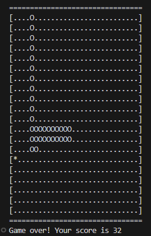

# Snake game in terminal (no GUI)
This is a small side-project I did when learning c to get more comfortable in memory management and pointers. There are no dependencies on this project other than builtin libraries. It uses ansi escape sequences to manipulate the terminal. 

# Compile and run
Inside the terminal_snake directory, simply run:
```
make all
```

Then you start the game by running:

```
./snake
```

