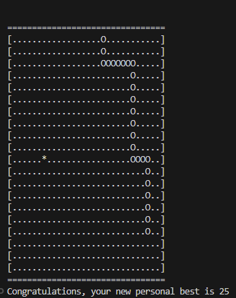

# Snake game in terminal (no GUI)
This is a small side-project I did when learning c to get more comfortable in memory management and pointers. There are no dependencies on this project other than built-in libraries as it uses ansi escape sequences to manipulate the terminal.

# Building and running
1. Clone repository with `git clone https://github.com/Larmix0/terminal-snake.git`

2. Go inside the project with `cd terminal_snake`

3. 
    * `cd linux` if you're on Linux.
    * `cd windows` if you're on Windows.

4. Run `make` to compile and then `./bin/snake` to start the game.

